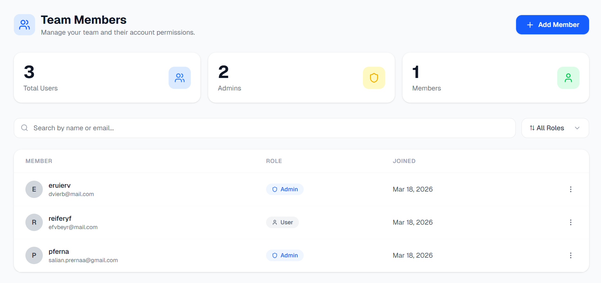
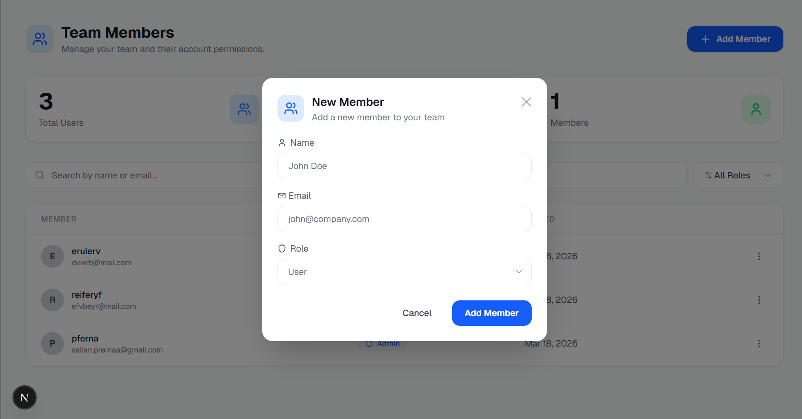
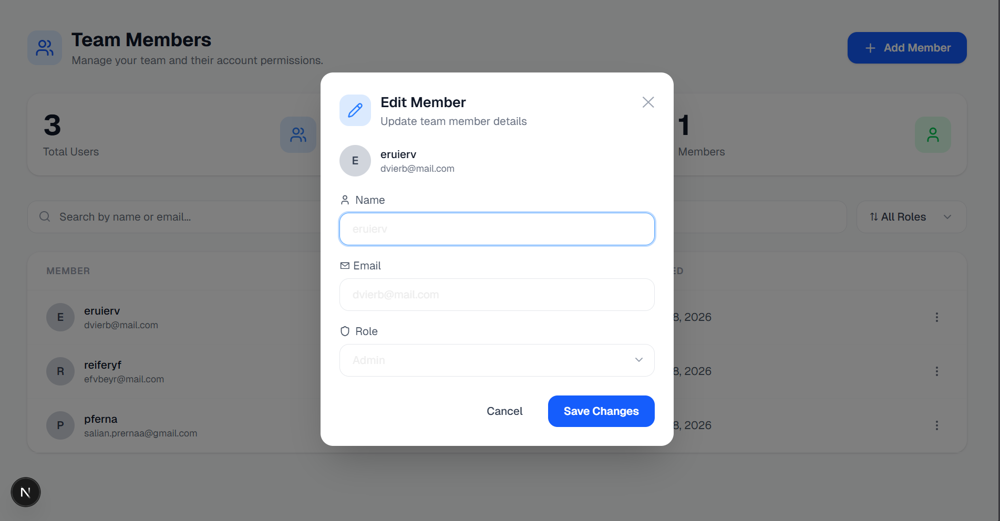
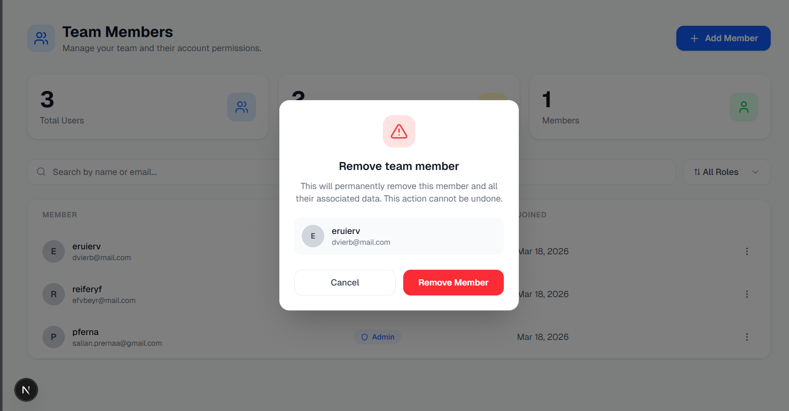

# 👥 Team Members — User Management System

A full-stack user management application built with **Next.js**, **TypeScript**, **Prisma ORM**, and **SQLite**.

---

## 🚀 Tech Stack

| Layer | Technology |
|-------|-----------|
| Frontend | Next.js 16 + React + TypeScript |
| Styling | Tailwind CSS |
| Backend | Next.js API Routes |
| ORM | Prisma v7 |
| Database | SQLite (local) |
| Icons | Lucide React |

---

## ✨ Features

- ✅ View all team members in a clean table
- ✅ Add new members with form validation
- ✅ Edit existing member details
- ✅ Delete members with confirmation dialog
- ✅ Search by name or email
- ✅ Filter by role (Admin / User)
- ✅ Pagination (5 members per page)
- ✅ Toast notifications for all actions
- ✅ Loading states
- ✅ Fully responsive layout
- ✅ TypeScript throughout
- ✅ React Hooks

---

## 📁 Project Structure

```
src/
├── app/
│   ├── api/
│   │   └── users/
│   │       ├── route.ts          # GET, POST /api/users
│   │       └── [id]/
│   │           └── route.ts      # PUT, DELETE /api/users/:id
│   ├── page.tsx                  # Dashboard UI
│   ├── layout.tsx                # Root layout
│   └── globals.css               # Global styles
├── lib/
│   └── prisma.ts                 # Prisma client singleton
prisma/
├── schema.prisma                 # Database schema
├── prisma.config.ts              # Prisma v7 config
└── migrations/                   # Migration files
```

---

## ⚙️ Setup Instructions

### 1. Clone the repository

```bash
git clone https://github.com/your-username/user-management.git
cd user-management
```

### 2. Install dependencies

```bash
npm install
```

### 3. Install Prisma adapter

```bash
npm install @prisma/adapter-libsql
```

### 4. Set up Prisma config

Make sure `prisma/prisma.config.ts` has:

```ts
import { defineConfig } from "prisma/config";

export default defineConfig({
  earlyAccess: true,
  datasource: {
    url: "file:./dev.db",
  },
});
```

And `src/lib/prisma.ts` has:

```ts
import { PrismaClient } from "@prisma/client";
import { PrismaLibSql } from "@prisma/adapter-libsql";

const adapter = new PrismaLibSql({
  url: "file:./dev.db",
});

const globalForPrisma = globalThis as unknown as {
  prisma: PrismaClient | undefined;
};

export const prisma =
  globalForPrisma.prisma ?? new PrismaClient({ adapter });

if (process.env.NODE_ENV !== "production") {
  globalForPrisma.prisma = prisma;
}
```

### 5. Run database migration

```bash
npx prisma migrate dev --name init
npx prisma generate
```

### 6. Start the development server

```bash
npm run dev
```

### 7. Open in browser

```
http://localhost:3000
```

---

## 🔌 API Endpoints

| Method | Endpoint | Description |
|--------|----------|-------------|
| GET | `/api/users` | Fetch all users |
| POST | `/api/users` | Create a new user |
| PUT | `/api/users/:id` | Update a user |
| DELETE | `/api/users/:id` | Delete a user |

---

## 🗄️ Database Schema

```prisma
model User {
  id        Int      @id @default(autoincrement())
  name      String
  email     String   @unique
  role      String   @default("User")
  createdAt DateTime @default(now())
}
```

---

## 📸 Screenshots

### Dashboard


### Add Member


### Edit Member


### Delete Confirmation


---

## 📝 Notes

- This project uses **Prisma v7** which requires `prisma.config.ts` instead of `DATABASE_URL` in `.env`
- SQLite database file (`dev.db`) is created automatically after migration
- Pagination shows 5 members per page by default

---

## 👩‍💻 Author

Built as part of a full-stack assignment using Next.js + Prisma + SQLite.